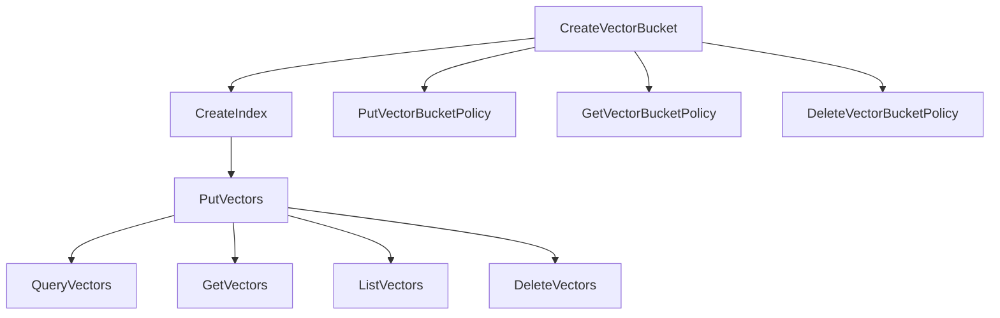

# TOS Vectors Agent Skills

## 概述
TOS Vectors 是对象存储（TOS）为 AI 原生时代设计的存储、查询和管理向量数据的新存储服务。本文档定义了与 TOS Vectors 交互的 Agent Skills 结构。

## 核心概念

### 实体定义
- **向量桶 (Vector Bucket)**: 顶层命名空间，类似数据库的库概念
- **向量索引 (Vector Index)**: 次层命名空间，类似数据库的表概念
- **向量 (Vector)**: 基本数据单元，包含 key、data、metadata
- **地域 (Region)**: 数据中心地理位置 (cn-beijing, cn-shanghai, cn-guangzhou)
- **访问域名 (Endpoint)**:
  - Region Endpoint: `tosvectors-{region}.volces.com`
  - Bucket Endpoint: `{VectorBucketName}-{AccountID}.tosvectors-{region}.volces.com`

---

## Skill Category 1: 向量桶管理 (Vector Bucket Management)

### Skill 1.1: CreateVectorBucket
**功能**: 创建新的向量桶

**输入参数**:
```json
{
  "vectorBucketName": {
    "type": "string",
    "required": true,
    "constraints": {
      "minLength": 3,
      "maxLength": 32,
      "pattern": "^[a-z0-9][a-z0-9-]*[a-z0-9]$",
      "description": "只能包含小写字母、数字和短横线，不能以短横线开头或结尾"
    }
  }
}
```

**输出**:
```json
{
  "requestId": "string",
  "statusCode": 200
}
```

**Python SDK 示例**:
```python
import tos

client = tos.VectorClient(ak, sk, endpoint, region)
result = client.create_vector_bucket(vector_bucket_name)
```

**使用场景**:
- 初始化向量存储空间
- 为新项目创建独立的向量存储桶
- 限制: 单用户全局最多 100 个向量桶

---

### Skill 1.2: DeleteVectorBucket
**功能**: 删除已创建的向量桶（必须为空桶）

**输入参数**:
```json
{
  "vectorBucketName": {
    "type": "string",
    "required": true
  },
  "accountId": {
    "type": "string",
    "required": true,
    "description": "账户ID，用于权限验证"
  }
}
```

**前置条件**:
- 向量桶必须为空（所有向量索引已删除）

**输出**:
```json
{
  "requestId": "string",
  "statusCode": 200
}
```

**Python SDK 示例**:
```python
result = client.delete_vector_bucket(vector_bucket_name, account_id)
```

---

### Skill 1.3: GetVectorBucket
**功能**: 查询向量桶的详细信息

**输入参数**:
```json
{
  "vectorBucketName": {
    "type": "string",
    "required": true
  },
  "accountId": {
    "type": "string",
    "required": true
  }
}
```

**输出**:
```json
{
  "vectorBucket": {
    "vectorBucketName": "string",
    "vectorBucketTrn": "string",
    "creationTime": "number",
    "projectName": "string"
  },
  "requestId": "string",
  "statusCode": 200
}
```

**Python SDK 示例**:
```python
result = client.get_vector_bucket(vector_bucket_name, account_id)
print(result.vector_bucket.vector_bucket_name)
print(result.vector_bucket.creation_time)
```

---

### Skill 1.4: ListVectorBuckets
**功能**: 分页列举向量桶列表

**输入参数**:
```json
{
  "maxResults": {
    "type": "integer",
    "required": false,
    "default": 100,
    "min": 1,
    "max": 500
  },
  "nextToken": {
    "type": "string",
    "required": false,
    "minLength": 1,
    "maxLength": 512
  },
  "prefix": {
    "type": "string",
    "required": false,
    "minLength": 1,
    "maxLength": 63,
    "description": "过滤以指定前缀开头的向量桶"
  }
}
```

**输出**:
```json
{
  "vectorBuckets": [
    {
      "vectorBucketName": "string",
      "vectorBucketTrn": "string",
      "creationTime": "number",
      "projectName": "string"
    }
  ],
  "nextToken": "string",
  "requestId": "string",
  "statusCode": 200
}
```

**Python SDK 示例**:
```python
# 第一页
page1 = client.list_vector_buckets(max_results=2)
# 第二页
if page1.next_token:
    page2 = client.list_vector_buckets(max_results=2, next_token=page1.next_token)
```

---

## Skill Category 2: 向量桶策略管理 (Vector Bucket Policy Management)

### Skill 2.1: PutVectorBucketPolicy
**功能**: 设置向量桶的 IAM 策略

**输入参数**:
```json
{
  "vectorBucketName": {
    "type": "string",
    "required": true,
    "minLength": 3,
    "maxLength": 32
  },
  "accountId": {
    "type": "string",
    "required": true
  },
  "policy": {
    "type": "string",
    "required": true,
    "description": "JSON 格式的 IAM 策略文本"
  }
}
```

**策略格式**:
```json
{
  "Version": "2012-10-17",
  "Statement": [
    {
      "Effect": "Allow",
      "Principal": ["accountId"],
      "Action": "tosvectors:GetVectorBucket",
      "Resource": "trn:tosvectors:{region}:{account-id}:bucket/{bucket-name}"
    }
  ]
}
```

**TRN 定义**:
- 向量桶: `trn:tosvectors:<region>:<account-id>:bucket/<bucket-name>`
- 向量索引: `trn:tosvectors:<region>:<account-id>:bucket/<bucket-name>/index/<index-name>`

**Python SDK 示例**:
```python
import json

policy = {
    "Version": "2012-10-17",
    "Statement": [{
        "Effect": "Allow",
        "Principal": [account_id],
        "Action": "tosvectors:GetVectorBucket",
        "Resource": f"trn:tosvectors:{region}:{account_id}:bucket/{vector_bucket_name}"
    }]
}
policy_json = json.dumps(policy)
result = client.put_vector_bucket_policy(vector_bucket_name, account_id, policy_json)
```

---

### Skill 2.2: GetVectorBucketPolicy
**功能**: 获取向量桶的 IAM 策略

**输入参数**:
```json
{
  "vectorBucketName": {
    "type": "string",
    "required": true
  },
  "accountId": {
    "type": "string",
    "required": true
  }
}
```

**输出**:
```json
{
  "policy": "string (JSON格式)",
  "requestId": "string",
  "statusCode": 200
}
```

**Python SDK 示例**:
```python
result = client.get_vector_bucket_policy(vector_bucket_name, account_id)
print(result.policy)
```

---

### Skill 2.3: DeleteVectorBucketPolicy
**功能**: 删除向量桶的 IAM 策略

**输入参数**:
```json
{
  "vectorBucketName": {
    "type": "string",
    "required": true
  },
  "accountId": {
    "type": "string",
    "required": true
  }
}
```

**输出**:
```json
{
  "requestId": "string",
  "statusCode": 200
}
```

**Python SDK 示例**:
```python
result = client.delete_vector_bucket_policy(vector_bucket_name, account_id)
```

---

## Skill Category 3: 向量索引管理 (Vector Index Management)

### Skill 3.1: CreateIndex
**功能**: 在向量桶下创建向量索引

**输入参数**:
```json
{
  "vectorBucketName": {
    "type": "string",
    "required": true
  },
  "accountId": {
    "type": "string",
    "required": true
  },
  "indexName": {
    "type": "string",
    "required": true,
    "minLength": 3,
    "maxLength": 63
  },
  "dataType": {
    "type": "string",
    "required": true,
    "enum": ["float32"],
    "description": "向量数据类型"
  },
  "dimension": {
    "type": "integer",
    "required": true,
    "min": 1,
    "max": 4096,
    "description": "向量维度"
  },
  "distanceMetric": {
    "type": "string",
    "required": true,
    "enum": ["euclidean", "cosine"],
    "description": "距离度量方式"
  },
  "metadataConfiguration": {
    "type": "object",
    "required": false,
    "properties": {
      "nonFilterableMetadataKeys": {
        "type": "array",
        "items": "string",
        "description": "不可用于筛选的元数据键列表"
      }
    }
  }
}
```

**输出**:
```json
{
  "requestId": "string",
  "statusCode": 200
}
```

**Python SDK 示例**:
```python
response = client.create_index(
    account_id=account_id,
    vector_bucket_name=vector_bucket_name,
    index_name="examplevectorindex",
    data_type=tos.DataType.DataTypeFloat32,
    dimension=128,
    distance_metric=tos.DistanceMetricType.DistanceMetricCosine
)
```

---

### Skill 3.2: DeleteIndex
**功能**: 删除向量桶的向量索引

**输入参数**:
```json
{
  "vectorBucketName": {
    "type": "string",
    "required": true
  },
  "accountId": {
    "type": "string",
    "required": true
  },
  "indexName": {
    "type": "string",
    "required": true
  }
}
```

**输出**:
```json
{
  "requestId": "string",
  "statusCode": 200
}
```

**Python SDK 示例**:
```python
result = client.delete_index(
    vector_bucket_name=vector_bucket_name,
    account_id=account_id,
    index_name=index_name
)
```

---

### Skill 3.3: GetIndex
**功能**: 获取向量索引的详细信息

**输入参数**:
```json
{
  "vectorBucketName": {
    "type": "string",
    "required": true
  },
  "accountId": {
    "type": "string",
    "required": true
  },
  "indexName": {
    "type": "string",
    "required": true
  }
}
```

**输出**:
```json
{
  "index": {
    "vectorBucketName": "string",
    "indexName": "string",
    "creationTime": "number",
    "dataType": "string",
    "dimension": "number",
    "distanceMetric": "string",
    "indexTrn": "string",
    "metadataConfiguration": {
      "nonFilterableMetadataKeys": ["string"]
    }
  },
  "requestId": "string",
  "statusCode": 200
}
```

**Python SDK 示例**:
```python
result = client.get_index(
    vector_bucket_name=vector_bucket_name,
    account_id=account_id,
    index_name=index_name
)
print(result.index.dimension)
print(result.index.distance_metric)
```

---

### Skill 3.4: ListIndexes
**功能**: 分页列举向量索引列表

**输入参数**:
```json
{
  "vectorBucketName": {
    "type": "string",
    "required": true
  },
  "accountId": {
    "type": "string",
    "required": true
  },
  "maxResults": {
    "type": "integer",
    "required": false,
    "default": 100,
    "min": 1,
    "max": 500
  },
  "nextToken": {
    "type": "string",
    "required": false,
    "minLength": 1,
    "maxLength": 512
  },
  "prefix": {
    "type": "string",
    "required": false,
    "minLength": 1,
    "maxLength": 63
  }
}
```

**输出**:
```json
{
  "indexes": [
    {
      "vectorBucketName": "string",
      "indexName": "string",
      "creationTime": "number",
      "indexTrn": "string"
    }
  ],
  "nextToken": "string",
  "requestId": "string",
  "statusCode": 200
}
```

**Python SDK 示例**:
```python
result = client.list_indexes(
    vector_bucket_name=vector_bucket_name,
    account_id=account_id
)
for index in result.indexes:
    print(f"Index: {index.index_name}, TRN: {index.index_trn}")
```

---

## Skill Category 4: 向量数据操作 (Vector Data Operations)

### Skill 4.1: PutVectors
**功能**: 批量插入向量到向量索引

**输入参数**:
```json
{
  "vectorBucketName": {
    "type": "string",
    "required": true
  },
  "accountId": {
    "type": "string",
    "required": true
  },
  "indexName": {
    "type": "string",
    "required": true
  },
  "vectors": {
    "type": "array",
    "required": true,
    "minItems": 1,
    "maxItems": 500,
    "items": {
      "key": {
        "type": "string",
        "required": true,
        "description": "向量唯一标识符"
      },
      "data": {
        "type": "object",
        "required": true,
        "properties": {
          "float32": {
            "type": "array",
            "items": "float",
            "description": "向量数据，维度必须与索引定义一致"
          }
        }
      },
      "metadata": {
        "type": "object",
        "required": false,
        "description": "用户自定义 KV 元数据"
      }
    }
  }
}
```

**输出**:
```json
{
  "requestId": "string",
  "statusCode": 200
}
```

**Python SDK 示例**:
```python
vectors = []
for i in range(3):
    vector_data = tos.models2.VectorData(
        float32=[float(x) for x in range(128)]
    )
    vector = tos.models2.Vector(
        key=f'vector-{i}',
        data=vector_data
    )
    vectors.append(vector)

result = client.put_vectors(
    vector_bucket_name=vector_bucket_name,
    account_id=account_id,
    index_name=index_name,
    vectors=vectors
)
```

**使用场景**:
- 批量导入向量数据
- 单次最多插入 500 个向量
- 向量维度必须与索引定义一致

---

### Skill 4.2: DeleteVectors
**功能**: 根据向量 key 批量删除向量

**输入参数**:
```json
{
  "vectorBucketName": {
    "type": "string",
    "required": true
  },
  "accountId": {
    "type": "string",
    "required": true
  },
  "indexName": {
    "type": "string",
    "required": true
  },
  "keys": {
    "type": "array",
    "required": true,
    "minItems": 1,
    "maxItems": 100,
    "items": {
      "type": "string",
      "minLength": 1,
      "maxLength": 1024
    }
  }
}
```

**输出**:
```json
{
  "requestId": "string",
  "statusCode": 200
}
```

**Python SDK 示例**:
```python
keys_to_delete = ['vector-key-1', 'vector-key-2', 'vector-key-3']

result = client.delete_vectors(
    vector_bucket_name=vector_bucket_name,
    account_id=account_id,
    index_name=index_name,
    keys=keys_to_delete
)
```

---

### Skill 4.3: GetVectors
**功能**: 根据向量 key 批量查询向量

**输入参数**:
```json
{
  "vectorBucketName": {
    "type": "string",
    "required": true
  },
  "accountId": {
    "type": "string",
    "required": true
  },
  "indexName": {
    "type": "string",
    "required": true
  },
  "keys": {
    "type": "array",
    "required": true,
    "minItems": 1,
    "maxItems": 100,
    "items": {
      "type": "string",
      "minLength": 1,
      "maxLength": 1024
    }
  },
  "returnData": {
    "type": "boolean",
    "required": false,
    "default": false,
    "description": "是否返回向量数据"
  },
  "returnMetadata": {
    "type": "boolean",
    "required": false,
    "default": false,
    "description": "是否返回元数据"
  }
}
```

**输出**:
```json
{
  "vectors": [
    {
      "key": "string",
      "data": {
        "float32": [0.1, 0.2, ...]
      },
      "metadata": {
        "key_a": "value_a"
      }
    }
  ],
  "requestId": "string",
  "statusCode": 200
}
```

**Python SDK 示例**:
```python
keys = ["product-vector-0", "product-vector-1", "product-vector-2"]

result = client.get_vectors(
    vector_bucket_name=vector_bucket_name,
    account_id=account_id,
    index_name=index_name,
    keys=keys,
    return_data=True,
    return_metadata=True
)

for vector in result.vectors:
    print(f"Key: {vector.key}")
    print(f"Data: {vector.data.float32}")
    print(f"Metadata: {vector.metadata}")
```

---

### Skill 4.4: ListVectors
**功能**: 分页查询向量列表

**输入参数**:
```json
{
  "vectorBucketName": {
    "type": "string",
    "required": true
  },
  "accountId": {
    "type": "string",
    "required": true
  },
  "indexName": {
    "type": "string",
    "required": true
  },
  "maxResults": {
    "type": "integer",
    "required": false,
    "default": 500,
    "min": 1,
    "max": 1000,
    "description": "最大返回数量，超过1MB会提前停止并返回已检索的向量以及用于后续请求的nextToken"
  },
  "nextToken": {
    "type": "string",
    "required": false,
    "minLength": 1,
    "maxLength": 2048
  },
  "returnData": {
    "type": "boolean",
    "required": false,
    "default": false
  },
  "returnMetadata": {
    "type": "boolean",
    "required": false,
    "default": false
  }
}
```

**输出**:
```json
{
  "vectors": [
    {
      "key": "string",
      "data": {
        "float32": [...]
      },
      "metadata": {}
    }
  ],
  "nextToken": "string",
  "requestId": "string",
  "statusCode": 200
}
```

**Python SDK 示例**:
```python
result = client.list_vectors(
    vector_bucket_name=vector_bucket_name,
    index_name=index_name,
    account_id=account_id,
    return_data=True,
    return_metadata=True,
    max_results=100
)

for vector in result.vectors:
    print(f"Key: {vector.key}")
```

---

### Skill 4.5: QueryVectors
**功能**: 根据目标向量 KNN 查询距离最近的 TopK 向量（向量相似度搜索）

**输入参数**:
```json
{
  "vectorBucketName": {
    "type": "string",
    "required": true
  },
  "accountId": {
    "type": "string",
    "required": true
  },
  "indexName": {
    "type": "string",
    "required": true
  },
  "queryVector": {
    "type": "object",
    "required": true,
    "properties": {
      "float32": {
        "type": "array",
        "items": "float",
        "description": "查询向量，维度必须与索引一致"
      }
    }
  },
  "topK": {
    "type": "integer",
    "required": true,
    "min": 1,
    "max": 30,
    "description": "返回最相似的向量数量"
  },
  "returnDistance": {
    "type": "boolean",
    "required": false,
    "default": false,
    "description": "是否返回距离值"
  },
  "returnMetadata": {
    "type": "boolean",
    "required": false,
    "default": false,
    "description": "是否返回元数据"
  },
  "filter": {
    "type": "object",
    "required": false,
    "description": "元数据筛选器，支持 $and 等操作符"
  }
}
```

**输出**:
```json
{
  "vectors": [
    {
      "key": "string",
      "data": {
        "float32": [...]
      },
      "distance": 0.05,
      "metadata": {}
    }
  ],
  "requestId": "string",
  "statusCode": 200
}
```

**Python SDK 示例**:
```python
import random
from tos.models2 import VectorData

# 创建查询向量
query_vector = VectorData(float32=[float(random.random()) for _ in range(128)])

# 执行向量相似度搜索
result = client.query_vectors(
    vector_bucket_name=vector_bucket_name,
    account_id=account_id,
    index_name=index_name,
    query_vector=query_vector,
    top_k=5,
    return_distance=True,
    return_metadata=True
)

# 打印搜索结果
for i, vector in enumerate(result.vectors):
    print(f"Top {i+1}:")
    print(f"  Key: {vector.key}")
    print(f"  Distance: {vector.distance:.4f}")
    print(f"  Metadata: {vector.metadata}")
```

**使用场景**:
- 语义搜索：根据查询文本的向量找到最相似的文档
- 推荐系统：根据用户/物品向量找到最相似的推荐项
- 图像检索：根据图像特征向量找到相似图片
- 异常检测：找到与正常模式距离最远的向量

**元数据过滤示例**:
```python
# 使用元数据过滤
result = client.query_vectors(
    vector_bucket_name=vector_bucket_name,
    account_id=account_id,
    index_name=index_name,
    query_vector=query_vector,
    top_k=10,
    filter={"$and": [{"category": "electronics"}]},
    return_distance=True,
    return_metadata=True
)
```

---

## Skill Category 5: 错误处理 (Error Handling)

### 错误响应结构
```json
{
  "Code": "string",
  "RequestId": "string",
  "HostId": "string",
  "Message": "string",
  "EC": "string"
}
```

### 常见错误码

| 错误码 | HTTP状态码 | 说明 | 处理建议 |
|--------|-----------|------|---------|
| **AccessDeniedException** | 403 | 访问被拒绝 | 检查 AK/SK 和 IAM 策略 |
| **ConflictException** | 409 | 资源名称已存在 | 使用不同的桶名或索引名 |
| **InternalServerException** | 500 | 内部服务器错误 | 重试请求 |
| **ServiceQuotaExceededException** | 402 | 超过服务配额 | 联系管理员提升配额 |
| **ServiceUnavailableException** | 503 | 服务不可用 | 增加重试间隔后重试 |
| **TooManyRequestsException** | 429 | 请求被限流 | 实施退避重试策略 |
| **ValidationException** | 400 | 请求参数无效 | 检查请求参数格式 |

### Python SDK 错误处理示例
```python
import tos

try:
    result = client.create_vector_bucket(vector_bucket_name)
    print('操作成功')

except tos.exceptions.TosClientError as e:
    # 客户端异常：非法请求参数或网络异常
    print(f'客户端错误: {e.message}, 原因: {e.cause}')

except tos.exceptions.TosServerError as e:
    # 服务端异常：可从返回信息中获取详细错误
    print(f'服务端错误码: {e.code}')
    print(f'请求ID: {e.request_id}')  # 用于问题定位
    print(f'错误消息: {e.message}')
    print(f'HTTP状态码: {e.status_code}')
    print(f'EC码: {e.ec}')
    print(f'请求URL: {e.request_url}')

except Exception as e:
    print(f'未知错误: {e}')
```

---

## Skill Category 6: 最佳实践 (Best Practices)

### 6.1 初始化客户端
```python
import os
import tos

# 从环境变量获取凭证（推荐）
ak = os.getenv('TOS_ACCESS_KEY')
sk = os.getenv('TOS_SECRET_KEY')
account_id = os.getenv('TOS_ACCOUNT_ID')

# 配置 endpoint 和 region
# 内网: tosvectors-cn-beijing.ivolces.com
# 外网: tosvectors-cn-beijing.volces.com
endpoint = 'https://tosvectors-cn-beijing.volces.com'
region = 'cn-beijing'

# 创建客户端
client = tos.VectorClient(ak, sk, endpoint, region)
```

### 6.2 命名规范
- **向量桶名称**:
  - 长度: 3-32 字符
  - 字符: 小写字母、数字、短横线
  - 规则: 不能以短横线开头或结尾
  - 示例: `my-vector-bucket`, `prod-embeddings-01`

- **向量索引名称**:
  - 长度: 3-63 字符
  - 示例: `user-embeddings`, `product-vectors`

- **向量 Key**:
  - 长度: 1-1024 字符
  - 建议: 使用有意义的标识符
  - 示例: `user-12345`, `doc-abc-v1`

### 6.3 批量操作优化
```python
# 批量插入向量（推荐）
vectors = []
for i in range(500):  # 单次最多 500 个
    vector = tos.models2.Vector(
        key=f'batch-{i}',
        data=tos.models2.VectorData(float32=[...])
    )
    vectors.append(vector)

client.put_vectors(
    vector_bucket_name=bucket_name,
    account_id=account_id,
    index_name=index_name,
    vectors=vectors
)
```

### 6.4 分页查询模式
```python
# 分页列举所有向量
next_token = None
all_vectors = []

while True:
    result = client.list_vectors(
        vector_bucket_name=bucket_name,
        index_name=index_name,
        account_id=account_id,
        max_results=100,
        next_token=next_token
    )

    all_vectors.extend(result.vectors)

    if not result.next_token:
        break
    next_token = result.next_token

print(f'总共获取 {len(all_vectors)} 个向量')
```

### 6.5 向量搜索优化
```python
# 使用元数据过滤提高搜索精度
result = client.query_vectors(
    vector_bucket_name=bucket_name,
    account_id=account_id,
    index_name=index_name,
    query_vector=query_vector,
    top_k=10,
    filter={"$and": [{"category": "electronics"}, {"price_range": "high"}]},
    return_distance=True,
    return_metadata=True
)

# 根据距离阈值过滤结果
filtered_results = [v for v in result.vectors if v.distance < 0.5]
```

---

## Skill Category 7: 典型工作流程 (Typical Workflows)

### 7.1 完整的向量存储初始化流程
```python
import os
import tos

# 1. 初始化客户端
ak = os.getenv('TOS_ACCESS_KEY')
sk = os.getenv('TOS_SECRET_KEY')
account_id = os.getenv('TOS_ACCOUNT_ID')
endpoint = 'https://tosvectors-cn-beijing.volces.com'
region = 'cn-beijing'

client = tos.VectorClient(ak, sk, endpoint, region)

# 2. 创建向量桶
bucket_name = 'my-ai-vectors'
client.create_vector_bucket(bucket_name)

# 3. 创建向量索引
client.create_index(
    account_id=account_id,
    vector_bucket_name=bucket_name,
    index_name='embeddings-768d',
    data_type=tos.DataType.DataTypeFloat32,
    dimension=768,
    distance_metric=tos.DistanceMetricType.DistanceMetricCosine
)

# 4. 插入向量数据
vectors = []
for i in range(100):
    vector = tos.models2.Vector(
        key=f'doc-{i}',
        data=tos.models2.VectorData(float32=[0.1] * 768),
        metadata={'title': f'Document {i}', 'category': 'tech'}
    )
    vectors.append(vector)

client.put_vectors(
    vector_bucket_name=bucket_name,
    account_id=account_id,
    index_name='embeddings-768d',
    vectors=vectors
)

print('向量存储初始化完成')
```

### 7.2 语义搜索工作流程
```python
# 1. 准备查询向量（通常来自文本嵌入模型）
query_text = "人工智能技术"
query_embedding = get_text_embedding(query_text)  # 假设的嵌入函数

# 2. 创建查询向量
query_vector = tos.models2.VectorData(float32=query_embedding)

# 3. 执行向量搜索
results = client.query_vectors(
    vector_bucket_name=bucket_name,
    account_id=account_id,
    index_name='embeddings-768d',
    query_vector=query_vector,
    top_k=5,
    return_distance=True,
    return_metadata=True
)

# 4. 处理搜索结果
for i, vector in enumerate(results.vectors):
    print(f"排名 {i+1}:")
    print(f"  文档ID: {vector.key}")
    print(f"  相似度分数: {1 - vector.distance:.4f}")
    print(f"  标题: {vector.metadata.get('title')}")
    print(f"  类别: {vector.metadata.get('category')}")
```

---

### 7.3 RAG (检索增强生成) 工作流程
```python
# 1. 用户提问
user_question = "什么是向量数据库？"

# 2. 将问题转换为向量
question_embedding = get_text_embedding(user_question)
query_vector = tos.models2.VectorData(float32=question_embedding)

# 3. 检索相关文档
search_results = client.query_vectors(
    vector_bucket_name=bucket_name,
    account_id=account_id,
    index_name='knowledge-base',
    query_vector=query_vector,
    top_k=3,
    return_metadata=True
)

# 4. 构建上下文
context = "\n\n".join([
    v.metadata.get('content', '')
    for v in search_results.vectors
])

# 5. 生成回答（使用 LLM）
prompt = f"基于以下上下文回答问题：\n\n{context}\n\n问题：{user_question}"
answer = call_llm(prompt)  # 假设的 LLM 调用

print(f"回答: {answer}")
```

### 7.4 向量数据更新流程
```python
# 1. 查询现有向量
existing = client.get_vectors(
    vector_bucket_name=bucket_name,
    account_id=account_id,
    index_name=index_name,
    keys=['doc-1', 'doc-2'],
    return_metadata=True
)

# 2. 删除旧向量
client.delete_vectors(
    vector_bucket_name=bucket_name,
    account_id=account_id,
    index_name=index_name,
    keys=['doc-1', 'doc-2']
)

# 3. 插入新向量
new_vectors = [
    tos.models2.Vector(
        key='doc-1',
        data=tos.models2.VectorData(float32=new_embedding_1),
        metadata={'version': 'v2', 'updated_at': '2026-01-29'}
    ),
    tos.models2.Vector(
        key='doc-2',
        data=tos.models2.VectorData(float32=new_embedding_2),
        metadata={'version': 'v2', 'updated_at': '2026-01-29'}
    )
]

client.put_vectors(
    vector_bucket_name=bucket_name,
    account_id=account_id,
    index_name=index_name,
    vectors=new_vectors
)
```

---

## Skill Category 8: 应用场景 (Use Cases)

### 8.1 语义搜索系统
**技能组合**: CreateIndex → PutVectors → QueryVectors

**场景描述**: 构建基于语义理解的文档搜索系统

**实现步骤**:
1. 使用 CreateIndex 创建文档向量索引（维度根据嵌入模型决定）
2. 使用 PutVectors 批量导入文档向量和元数据
3. 使用 QueryVectors 根据查询向量检索最相关文档

**适用领域**: 知识库搜索、文档检索、问答系统

---

### 8.2 推荐系统
**技能组合**: CreateIndex → PutVectors → QueryVectors (with metadata filter)

**场景描述**: 基于用户/物品向量的个性化推荐

**实现步骤**:
1. 创建用户向量索引和物品向量索引
2. 存储用户行为向量和物品特征向量
3. 使用元数据过滤（类别、价格等）进行精准推荐

**适用领域**: 电商推荐、内容推荐、社交推荐

---

### 8.3 图像检索
**技能组合**: CreateIndex → PutVectors → QueryVectors

**场景描述**: 以图搜图功能

**实现步骤**:
1. 使用图像嵌入模型提取图像特征向量
2. 存储图像向量及元数据（标签、分类等）
3. 根据查询图像向量检索相似图片

**适用领域**: 图片搜索、商品识别、人脸识别

---

### 8.4 异常检测
**技能组合**: PutVectors → QueryVectors

**场景描述**: 检测异常行为或数据

**实现步骤**:
1. 存储正常行为的向量表示
2. 对新数据进行向量查询
3. 距离较远的向量可能表示异常

**适用领域**: 欺诈检测、网络安全、质量控制

---

## Skill Category 9: 技能依赖关系 (Skill Dependencies)

### 9.1 技能执行顺序



### 9.2 前置依赖关系

| 技能 | 前置依赖 | 说明 |
|------|---------|------|
| CreateIndex | CreateVectorBucket | 必须先创建向量桶 |
| PutVectors | CreateIndex | 必须先创建向量索引 |
| QueryVectors | PutVectors | 索引中必须有向量数据 |
| GetVectors | PutVectors | 必须先插入向量 |
| DeleteVectorBucket | DeleteIndex | 必须先删除所有索引 |
| PutVectorBucketPolicy | CreateVectorBucket | 必须先创建向量桶 |

### 9.3 技能组合模式

**模式 1: 快速启动**
```
CreateVectorBucket → CreateIndex → PutVectors → QueryVectors
```

**模式 2: 完整管理**
```
CreateVectorBucket → PutVectorBucketPolicy → CreateIndex →
PutVectors → QueryVectors → DeleteVectors → DeleteIndex →
DeleteVectorBucket
```

**模式 3: 数据维护**
```
ListVectors → GetVectors → DeleteVectors → PutVectors
```

---

## Skill Category 10: 配额和限制 (Quotas and Limits)

### 10.1 资源限制

| 资源类型 | 限制 | 说明 |
|---------|------|------|
| 向量桶数量 | 100 | 单账户全局最多 100 个（包含普通桶） |
| 向量索引数量 | 无明确限制 | 单个向量桶内可创建多个索引 |
| 向量维度 | 1-4096 | 单个向量的维度范围 |
| 向量 Key 长度 | 1-1024 字符 | 向量唯一标识符长度 |
| 桶名长度 | 3-32 字符 | 向量桶名称长度 |
| 索引名长度 | 3-63 字符 | 向量索引名称长度 |

### 10.2 操作限制

| 操作 | 限制 | 说明 |
|------|------|------|
| PutVectors | 1-500 个/次 | 单次批量插入向量数量 |
| GetVectors | 1-100 个/次 | 单次批量查询向量数量 |
| DeleteVectors | 1-100 个/次 | 单次批量删除向量数量 |
| QueryVectors TopK | 1-30 | 单次查询返回的最大向量数 |
| ListVectors MaxResults | 1-1000 | 单次列举的最大向量数 |
| ListVectors 数据大小 | 1MB | 超过 1MB 会提前停止并返回 nextToken |
| ListVectorBuckets MaxResults | 1-500 | 单次列举的最大桶数 |
| ListIndexes MaxResults | 1-500 | 单次列举的最大索引数 |

### 10.3 性能建议

- **批量操作**: 尽量使用批量接口，减少 API 调用次数
- **分页查询**: 使用 nextToken 进行分页，避免一次性加载大量数据
- **元数据过滤**: 合理使用元数据过滤减少返回数据量
- **向量维度**: 根据实际需求选择合适的维度，过高维度会影响性能
- **距离度量**: 根据应用场景选择合适的距离度量方式（欧氏距离 vs 余弦相似度）

---

## 快速参考 (Quick Reference)

### 技能分类总览

| 分类 | 技能数量 | 主要功能 |
|------|---------|---------|
| 向量桶管理 | 4 | 创建、删除、查询、列举向量桶 |
| 向量桶策略管理 | 3 | 设置、获取、删除 IAM 策略 |
| 向量索引管理 | 4 | 创建、删除、查询、列举向量索引 |
| 向量数据操作 | 5 | 插入、删除、查询、列举、搜索向量 |
| 错误处理 | - | 统一的错误处理机制 |
| 最佳实践 | - | 客户端初始化、批量操作、分页查询 |
| 典型工作流程 | 4 | 初始化、语义搜索、RAG、数据更新 |
| 应用场景 | 4 | 语义搜索、推荐系统、图像检索、异常检测 |
| 技能依赖关系 | - | 技能执行顺序和组合模式 |
| 配额和限制 | - | 资源限制和性能建议 |

### 核心技能速查

```python
# 1. 初始化
client = tos.VectorClient(ak, sk, endpoint, region)

# 2. 创建向量桶
client.create_vector_bucket(bucket_name)

# 3. 创建索引
client.create_index(account_id, bucket_name, index_name,
                   data_type, dimension, distance_metric)

# 4. 插入向量
client.put_vectors(bucket_name, account_id, index_name, vectors)

# 5. 向量搜索
client.query_vectors(bucket_name, account_id, index_name,
                    query_vector, top_k)

# 6. 查询向量
client.get_vectors(bucket_name, account_id, index_name, keys)

# 7. 删除向量
client.delete_vectors(bucket_name, account_id, index_name, keys)
```

---

## 总结

本文档定义了 TOS Vectors 的完整 Agent Skills 结构，包含：

- **16 个核心技能**: 覆盖向量桶、索引、数据的完整生命周期管理
- **4 大应用场景**: 语义搜索、推荐系统、图像检索、异常检测
- **完整的错误处理**: 7 种常见错误码及处理建议
- **最佳实践指南**: 批量操作、分页查询、性能优化
- **典型工作流程**: 从初始化到实际应用的完整示例

### 关键特性

1. **AI 原生设计**: 专为向量数据存储和检索优化
2. **高性能搜索**: 支持 KNN 向量相似度搜索
3. **灵活的元数据**: 支持元数据过滤和查询
4. **完整的 SDK**: Python SDK 提供友好的 API 接口
5. **企业级可靠性**: 完善的错误处理和配额管理

### 适用场景

- RAG (检索增强生成) 系统
- 语义搜索引擎
- 推荐系统
- 图像/视频检索
- 异常检测
- 知识图谱

---

**文档版本**: v1.0
**最后更新**: 2026-01-29
**基于**: TOS Vectors Python SDK


